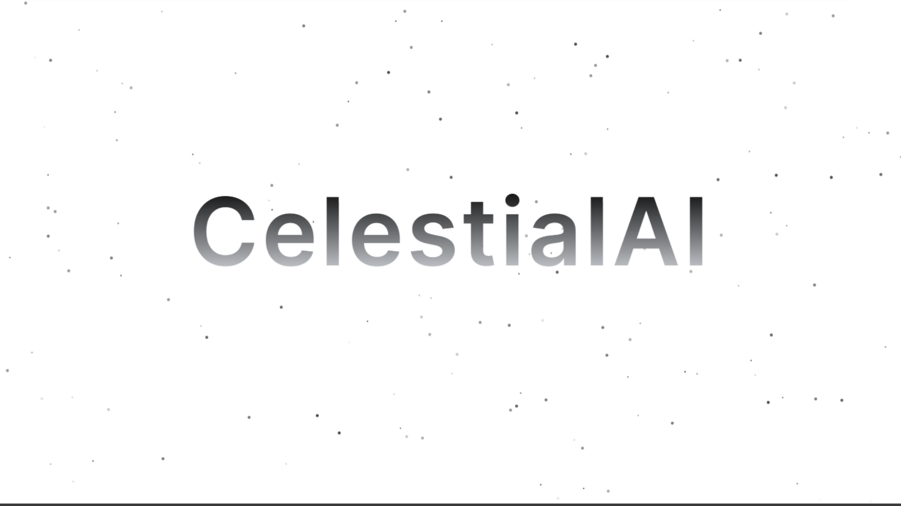

<div align="center" width="100%">
    
</div>

## CelestialAI

CelestialAI is an AI powered search engine, with robust feature such as building own chatbot and generating real time chart for data analysis.
Additionally connected with third party integration like notion and dropbox for seamless integration. 

> This is an Open source verison of [our official hosted service](https://celestialai.co/), we believe that open source will be a great contribute towards the open source community and benefit people looking forward to selfhost their own AI tools. 

> **[CelestialAI](https://celestialai.co/)** provides a complete Enterprise SaaS solution. Contact us at [notification@celestialai.co](mailto:notification@celestialai.co) for business inquiries.

> ❤️ We provide **free technical support for education instituion and NGO, feel free to reach out for deployment service as well**.

## Getting Started
The greatest way to get started is to utilize our hosted service, you can enjoy undisturbed experience without having to worry maintenance.
By doing so saves you immense amount of time and resources. 

Set Up .env:
Obtain API key from Kinde Auth, Pinecone, OpenAI, Anthrophic as well as Notion and Dropbox

```bash

DATABASE_URL=

KINDE_CLIENT_ID=
KINDE_CLIENT_SECRET=
KINDE_ISSUER_URL=
KINDE_SITE_URL=
KINDE_POST_LOGOUT_REDIRECT_URL=
KINDE_POST_LOGIN_REDIRECT_URL=

PINECONE_API_KEY=
PINECONE_Index=

OPENAI_API_KEY=
ANTHROPIC_API_KEY=

NEXT_PUBLIC_DROPBOX_KEY=
NEXT_PUBLIC_NOTIONURL=

OAUTH_CLIENT_ID=
OAUTH_CLIENT_SECRET=
OAUTH_REDIRECT_URI=
NOTION_AUTHORIZATION_URL=

```

As well as an S3 compatiable endpoint

```bash
S3_UPLOAD_KEY=
S3_UPLOAD_SECRET=
S3_UPLOAD_BUCKET=
S3_UPLOAD_REGION=

```


## Stack

> The Open source verison is nearly identical but focused on the ease of deployment, the underlying difference is on the backend. 
- Nextjs
- Lobe chat UI
- Shadcn UI
- Kinde Auth
- Vercel AI SDK
- Prisma
- Tavily search API
- S3 


## Deployment

The easiest way to deploy is 

- [](https://vercel.com/new/clone?repository-url=https%3A%2F%2Fgithub.com%2Fsuzushi-tw%2Fcelestialai-community&demo-title=CelestialAI&demo-url=https%3A%2F%2Fcelestialai.co%2F&demo-image=https%3A%2F%2Fimage.celestialai.co%2Fmetadata.PNG)

- [](https://cloud.digitalocean.com/apps/new?repo=https://github.com/suzushi-tw/celestialai-community&refcode=11745b6395ca)

- Cloudflare Pages (add Edge run time)


##  Artwork

Special thanks to all the artist for amazing artwork !
Artworks used in the project falls under their 利用規約,
which grants personal use and commercial use, however
the copy right belongs to the original author and shall
not be registered for trademark. 

- [ガーリー素材] (https://girlysozai.com/)
- [shigureni free illust] (https://www.shigureni.com/)


## License

Open source under Apache 2.0 License, This License does not grant permission to use the trade names, trademarks, service marks, or product names of the Licensor.